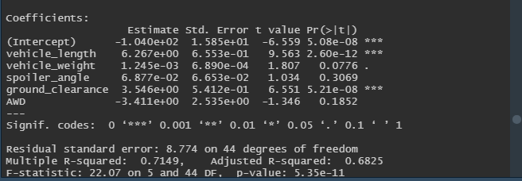
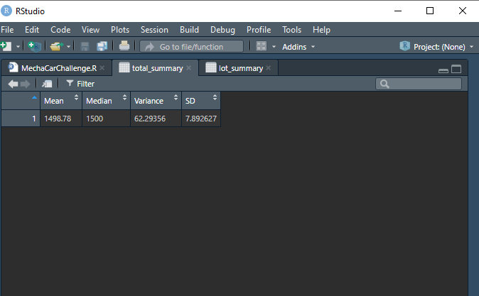
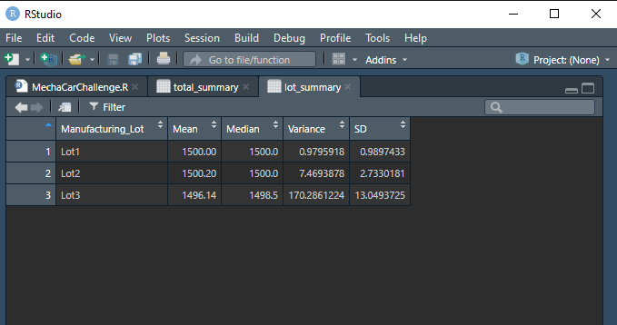
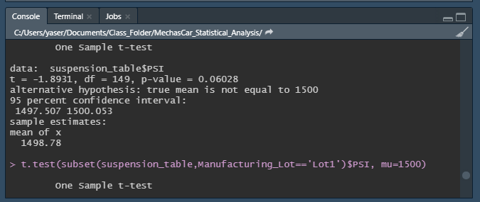
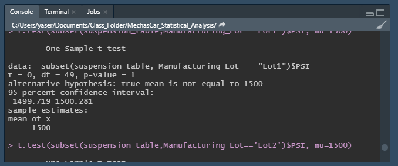
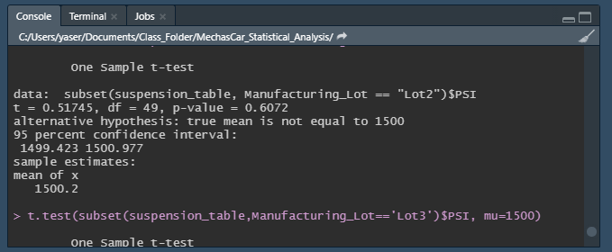
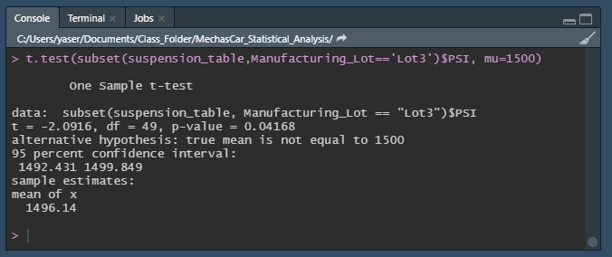

# MechasCar_Statistical_Analysis- Creating statistical tests with R

## Linear Regression to Predict MPG 

Which variables/coefficients provide a non-random amount of variance to the mpg values in the dataset?
  - There are 2 variables that show non-random amount of variance in the dataset and they are vehicle length and ground clearance.

Is the slope of the linear model considered to be zero? Why or why not?
  - The slope is not considered to be zero. When running the summary of the multiple regression model we get the p-value as 5.35e-11. This tells us that the p-value is much smaller than the significance value of .05. This shows that slope does not equal 0 because the there is a correlation that is not random chance.

Does this linear model predict mpg of MechaCar prototypes effectively? Why or why not?
  - Using the multiple linear regression gives great insight in seeing what effects mpg. However, when we look at the p-value of the intercept we see a value of 5.08 e-08. This shows that there are still other values/factors contribute to the mpg.

## Summary statistics on Suspension Coils

The design specifications for the MechaCar suspension coils dictate that the variance of the suspension coils must not exceed 100 pounds per square inch. Does the current manufacturing data meet this design specification for all manufacturing lots in total and each lot individually? Why or why not?
  - The total summary shows that MechaCar meet the current manufacturing standards. The variance as a total is 62.29. However, when we look at the lot summary, we can see that there is one lot that is not performing well that is affecting the total number. Lot 3 is showing that it is underperforming with a variance of 170 which does not dictate their specifications.

## T-Tests on Suspension Coils

  - The image shown above we are seeing the outcome of a t-test done on the total summary we can see after comparing the mean vs the population mean. After running the t-test we see that there is a p-value of .06028. This shows us that it does not reach the significant threshold of .05. Our null hypothesis is that all the manufacturing lots are not statistically different from the population mean of 1,500 pounds per square inch. With the p-value or .06028 this does not reject the null hypothesis.

	- 

  - When we see each individual lot, we see that there is one lot that is showing a difference that reaches the .05 significance threshold. Lot 3 has a p-value of .04168 this shows that this lot rejects the null hypothesis that all the manufacturing lots are not statistically different from the population mean of 1,500 pounds per square inch.

## Study Design: Mechachar vs Competition

When comparing MechaCar vs the competition we need to see how they fair against other competitors. A couple metrics we would need is the features and the sales data of the cars. Our null hypothesis would be that the features of our vehicle vs the competition does not affect the appeal of MechaCars. The alternative hypothesis would be that the features of our vehicle vs the competition does affect the appeal of MechaCars. The kind of test that I would use is an ANOVA test. The reason is we want to see if certain features and combination of features lead to more car sales. So, if we want to see if a car with CarPlay and backup camera sells better or if a car with heated seats and a backup camera.

The data we would need is to see the different models of cars and the sales information. Also, we need a list of the features for each one of the cars that sold. The data must match the cars MechaCar has to see what features are more desirable.
